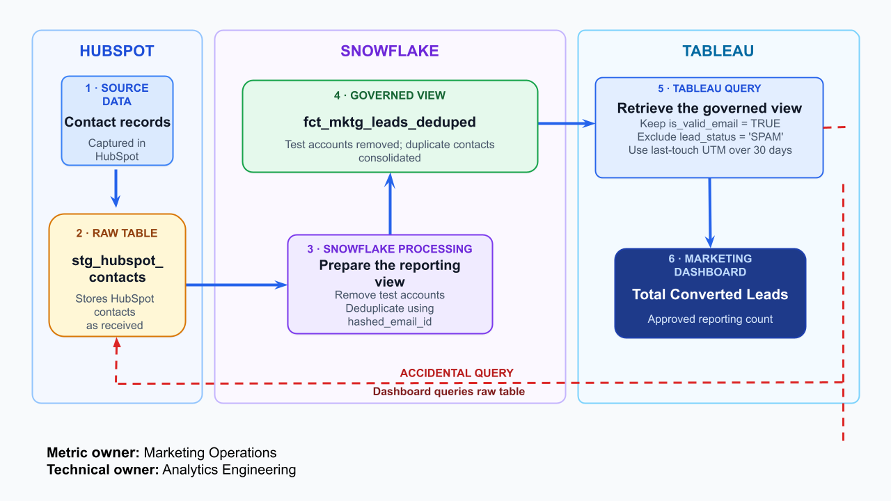

# Understanding Marketing Lead Counts: Raw Contacts vs. Attributed Leads

## Overview

This article is intended for Marketing Analysts and Marketing Operations teams who interpret, validate, or report lead counts. Analytics Engineers and Data Engineers can also use it to answer questions about how the metric is produced.

Marketing lead data originates in HubSpot and is processed in Snowflake before Tableau presents it as the **Total Converted Leads** metric. For governed reporting, Tableau uses a cleaned Snowflake view containing valid, non-spam, unique leads. Each lead is credited to its most recent marketing interaction within a 30-day window.

## Data flow and processing

HubSpot contact records are loaded into the Snowflake staging table `stg_hubspot_contacts`. Snowflake removes test accounts and deduplicates records using `hashed_email_id` to create the governed `fct_mktg_leads_deduped` view. Tableau queries this view with `is_valid_email = TRUE` and `lead_status != 'SPAM'`, then applies 30-day last-touch UTM attribution to calculate **Total Converted Leads**. The incorrect dashboard queries `stg_hubspot_contacts` directly, bypassing test-account removal and deduplication, which results in a different lead count.

- **Upstream source:** HubSpot → `stg_hubspot_contacts`
- **Governed dataset:** `fct_mktg_leads_deduped`
- **Downstream output:** Tableau Marketing Dashboard → **Total Converted Leads**
- **Metric owner:** Marketing Operations
- **Technical owner:** Analytics Engineering

## Resolve differences in lead counts

If the counts do not match, first check the Tableau dashboard’s data source. It must query `fct_mktg_leads_deduped`, not `stg_hubspot_contacts`. Using the raw table can include test accounts and count duplicate contacts more than once. Next, confirm that the query keeps `is_valid_email = TRUE`, applies `lead_status != 'SPAM'`, and uses 30-day last-touch UTM attribution. Use the governed view for executive reporting and the raw table only for exploratory analysis.
